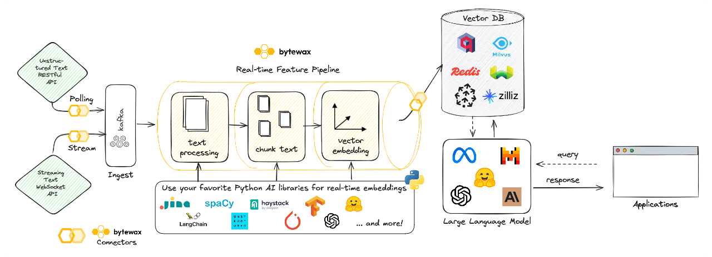
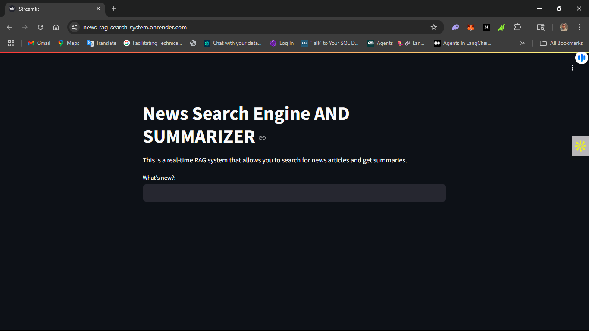
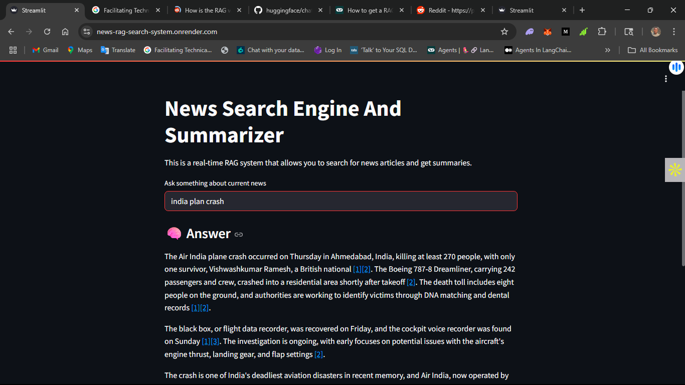

## 📰 Real-Time News Search App (RAG-Based) [SEE APP UI](https://news-rag-search-system.onrender.com/)

### Overview
This project is a real-time news search application that delivers factual, up-to-date answers using a Retrieval Augmented Generation (RAG) approach.

It solves the common problem of LLM hallucinations by grounding responses in actual news content — processed and retrieved in real time.

I built this with a focus on scalability, accuracy, and real-world performance using Dockerized components and Jinja for prompt versioning.

## 🔑 Key Features

* **Live News Ingestion** – Streams and processes news articles as they come in  
* **Semantic Search** – Finds results based on meaning, not just keywords  
* **Accurate Responses** – Uses actual news as context for answers  
* **Scalable & Modular** – Built with components that can scale independently  
* **LLM Grounding** – Reduces hallucination by using retrieved news facts  

## 🛠️ Tech Stack (What I Used & Why)

* **📦 Apache Kafka**  
  Used for streaming live news data.  
  → Shows my skills in handling real-time, high-throughput pipelines.

* **🧠 Bytewax**  
  A Python stream processing tool to clean and embed articles.  
  → Great for low-latency real-time transformation and vector generation.

* **🧭 Qdrant (Vector DB)**  
  Stores semantic embeddings of articles.  
  → Enables fast similarity search for relevant results.

* **🦙 Llama3 (via ChatGrop)**  
  Used to generate answers from the retrieved news context.  
  → Shows I can work with modern LLMs and integrate them into apps.

* **🔗 LangChain**  
  Manages the entire RAG pipeline — from query to response.  
  → Highlights my ability to orchestrate multi-component AI systems.

* **🐳 Docker**  
  Each component is containerized with Docker.  
  → Easy setup, deployment, and portability across environments.

* **🧾 Jinja**  
  Used for templating the prompt to Llama3, supports versioning.  
  → Helps with controlling LLM behavior and experimentation.

## 🧩 How It Works (Simplified Flow)

1. Kafka ingests real-time news streams  
2. Bytewax processes and generates semantic embeddings  
3. Qdrant stores embeddings for fast search  
4. User enters a query (e.g., “latest AI breakthroughs”)  
5. LangChain retrieves relevant news and formats the context  
6. Llama3 generates an answer based on retrieved info  
7. The user gets a grounded, concise response  

## 📦 Why This Stack?

| Goal                 | Solution Used                          |
|----------------------|----------------------------------------|
| Real-time processing | Kafka + Bytewax                        |
| Semantic relevance   | Qdrant vector DB                       |
| Answer generation    | Llama3 + LangChain + Jinja             |
| Easy deployment      | Docker images for all tools            |
| Accurate results     | RAG-based grounded answers             |

## 🚀 Possible Future Upgrades

* Add more news RSS for broader coverage  
* Include sentiment analysis for each news article  
* Summarize individual articles  
* Let users define their own news interests for personalization  

## 💼 What I Contributed

✅ Designed and built the pipeline  
✅ Integrated real-time streaming, embedding, and search  
✅ Used Docker for repeatable, production-style deployment  
✅ Applied Jinja for flexible prompt design  
✅ Implemented RAG to boost LLM accuracy  

## 🧠 Skills Demonstrated

* Real-time data engineering with Kafka & Bytewax  
* Semantic search with vector DBs (Qdrant)  
* LLM integration and prompt management  
* Scalable system design using containerized components  
* AI reliability and grounding with RAG architecture  

## 👋 Final Note

This project reflects how I bring together AI + data engineering to build systems that are practical, accurate, and production-ready. It's a clear example of solving a real-world problem using the latest tools in a clean, modular, and scalable way.
